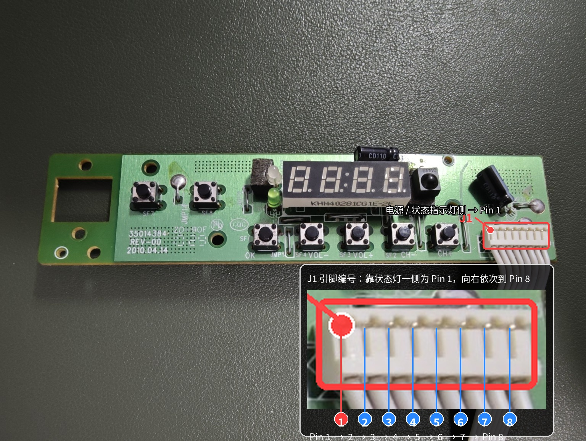

# LP-003 Pinout

## Pin 编号规则

所有引脚编号均以 PCB 元件面观察。

J1 最靠近电源 / 状态指示灯一侧的触点定义为 Pin 1，然后沿连接器向另一侧依次编号。
早期逆向记录曾从相反方向临时编号；本文件及 `profile.yaml` 均以此处正式编号为准。

## 引脚定义

| Pin | Signal | ESP32 GPIO | Direction | Notes |
| ---: | --- | ---: | --- | --- |
| 1 | VDD | - | 电源 | 已验证使用 3.3V 独立稳压供电 |
| 2 | GND | - | 电源 | 与 Pin 7 同一 GND 网络 |
| 3 | GREEN_LED_CTRL | 27 | 主控 -> 面板 | 高电平点亮绿灯 |
| 4 | IR_OUT | 26 | 面板 -> 主控 | 仅配置为输入，当前不解码 |
| 5 | DIO | 25 | 双向 | 显示数据写入与按键数据读取 |
| 6 | CLK | 33 | 主控 -> 面板 | CT1668 时钟 |
| 7 | GND | - | 电源 | 与 ESP32 和面板电源共地 |
| 8 | STB | 32 | 主控 -> 面板 | 板上路径约 100 ohms |

## 电气说明

- 面板使用 3.3V 供电，禁止在未重新确认电气规格前接入 5V。
- 使用独立电源时，ESP32、面板和电源必须共地。
- DIO 在读键期间从输出切换为输入；当前实现启用 ESP32 内部上拉。
- 红灯随面板供电常亮，不由 ESP32 控制。
- GPIO26 只作为 IR 输入保留，当前 Driver 不提供红外能力。
- CT1668 通讯按 TM1668 的命令、RAM 和时序兼容子集实现，不代表芯片完全兼容。

## 验证状态

- 低层显示扫描：已验证 4 位七段和中间冒号
- 新接线显示：已验证 GPIO32 / GPIO33 / GPIO25 总线稳定显示 `0000`
- 绿灯：已验证 GPIO27 高电平点亮
- 按键：7 个单键映射已验证
- 新接线按键：已验证 KEY_3 / OK 单次按压产生单个 PRIMARY Event
- 标准元件面 Pinout 图片：已补充
- Old Panel SDK Driver：已接入并通过主机测试
- PB Runtime：已构建、烧录、启动并成功拉取 Cloud State
- 当前显示、按键与 LED 接线：实机 PASS（2026-09-10）
- `hello-panel` / `factory-test` 完整验收：待验证

完整逆向证据见 `examples/ct1668-test/`。
